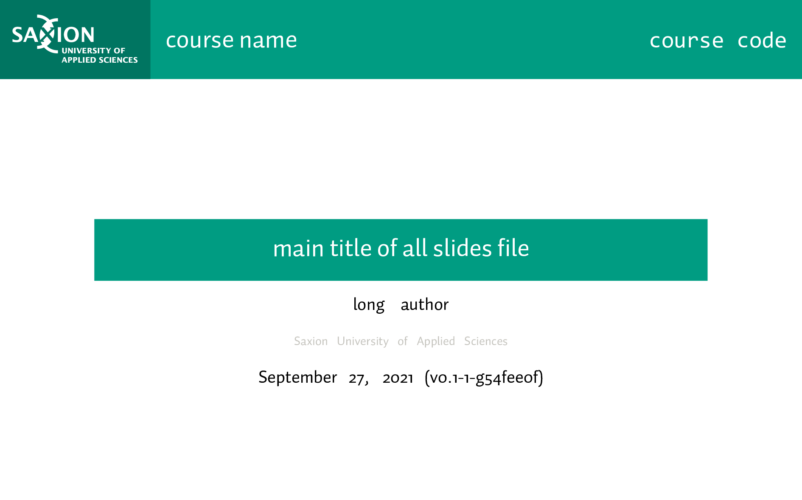

Course template repository
==========================

Getting started
---------------

1. Click the big ``Use this template`` button.
2. Enter a name, and clone the repository to a local directory.
3. Enter this repository using the terminal and run ``git submodule update --init``.
4. Change the example files to your liking and compile using the Makefile

Requirements
------------

* A recente tex-live or Miktex installation
* git
* The Auto 1 font, provided by Saxion.
  
  * You can change the font manually in ``lecture.sty`` if you don't have or don't want to use the Auto 1 font. Look for the heading 'Fonts' and replace all occurrences of ``Auto 1`` with another font installed on your system.

Examples
--------

  
  Example of using ``make lectures-slides``.

  
  Example of using ``make lectures-slides``.

Adding a lecture
----------------

1. Create a file ``lecture-<num>.tex`` in ``<repository-root>/course_materials/lectures/lectures``
2. Add ``<num>`` to ``NUMBERS`` in the Makefile.
3. Add a line with ``\includelecture{<num>}`` between ``\begin{document}`` and ``\end{document}`` in both ``lectures.slides.tex`` and ``lectures.notes.tex``.
4. Optionally if you use specific packages or settings for separate lectures, add the settings to both ``lectures.slides.tex`` and ``lectures.notes.tex``.

Makefile
--------

The Makefile can be invoked with the following targets:

* ``make lecture-<num>-slides``: Compiles the 'slides' version of the lecture, including animations. Look for 'modes' in `the beamer manual <http://mirrors.ctan.org/macros/latex/contrib/beamer/doc/beameruserguide.pdf>`_ for more information, in particular the 'presentation' mode.
* ``make lecture-<num>-handout``: Compiles the 'handout' version of the lecture, compressing most animations into single frames. Look for 'modes' in `the beamer manual <http://mirrors.ctan.org/macros/latex/contrib/beamer/doc/beameruserguide.pdf>`_ for more information, in particular the 'handout' mode.
* ``make <num>``: Combination of the two targets above.
* ``make lectures-slides``: Compiles a single file with all lectures, using 'presentation' mode.
* ``make lectures-handout``: Compiles a single file with all lectures, using 'handout' mode.
* ``make lectures-notes``: Compiles a beamer-article version of all lectures. This uses ``lectures.notes.tex`` as root file.
* ``make slides``: Runs ``make lecture-<num>-slides`` for all lectures, and ``make lectures-slides``.
* ``make handout``: Runs ``make lecture-<num>-handout`` for all lectures, and ``make lectures-handout``.
* ``make revision-file``: Generates a file from git information that defines macros that can be used for version information for the single file compile options.
* ``make clean``: Cleans auxillary files from compilations.
* ``make clean-pdf``: Same as above, but also deletes PDF files with the following regex: ``lecture*.pdf``. Take care not to delete versioned PDF releases.
* ``make all``: Cleans (including PDFs) first, then compiles everything, except ``lectures-notes``.
* ``make``: Same as above.
